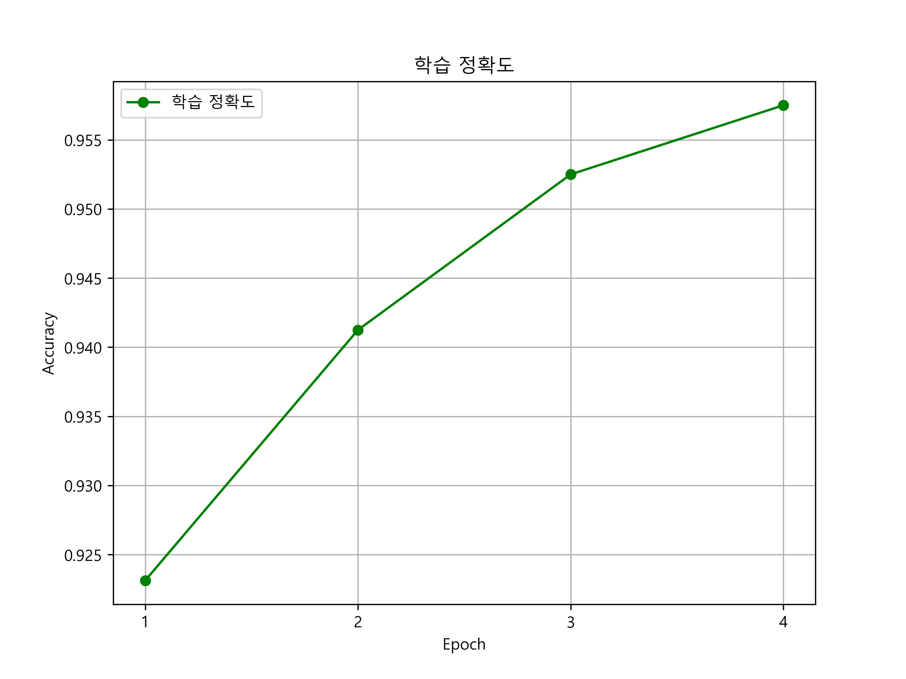
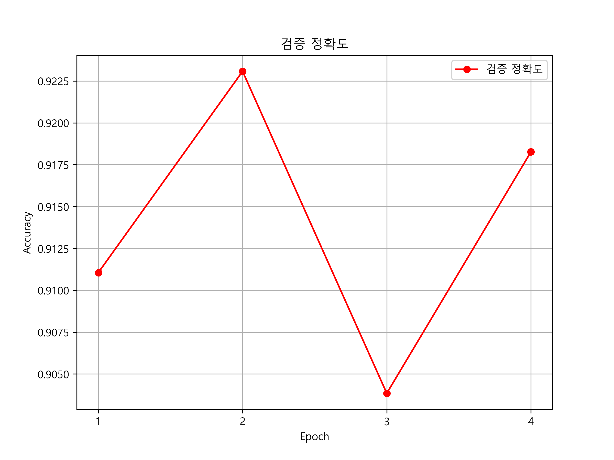
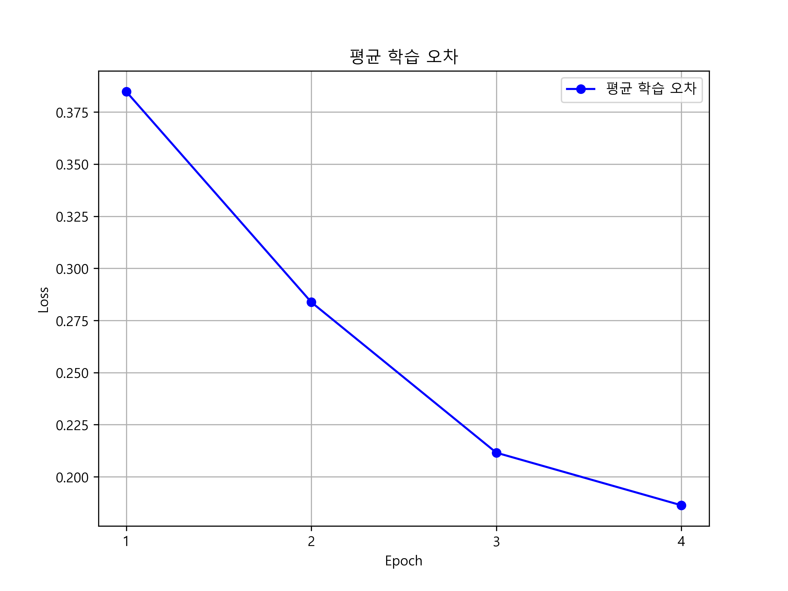

<p align="center">

<br>
</p>

# Koelectra를 활용한 hotelapp 리뷰 분석 프로젝트
<!-- 
badge icon 참고 사이트
https://github.com/danmadeira/simple-icon-badges
-->


## 1. 개 요
### 1.1 호텔앱 리뷰의 영향력
호텔앱을 통한 숙박 예약이 늘어나면서 호텔앱은 계속해서 성장해 나가고 있다.<br>
나는 계속 성장하는 호텔앱 시장을 보고 호텔앱 리뷰를 분석해 보고자 한다.<br>
호텔앱 시장에서도 소비자들의 리뷰는 매우 중요하다. 소비자들의 리뷰를 통해<br>
호텔앱이 성장을 할수있고 실제 매출에도 많은 영향을 줄수있다. 한국에서도<br>
호텔앱 업체에서도 소비자들의 리뷰를 지켜보며 사업방향을 정하는등의 노력을 기울이고 있다.<br>
### 1.2 문제 정의
한국에서 가장 유명한 두 호텔앱인 야놀자와 여기어때를 사용하는 소비자들의<br>
앱 리뷰를 포함하고있는 데이터이다. 이 프로젝트에서는 호텔앱 리뷰를 활용해<br>
한국어 리뷰를 한국어 자연어 처리를 통해 리뷰와 평점 등 다양한 특징에 따라<br>
긍정 또는 부정을 예측하는 인공지능 모델을 개발하고자 한다.<br>

## 2. 데이터
### 2.1 원시 데이터
[abouthere_reviews.json](./abouthere_reviews.json)<br>
[yanolja_reviews.json](./yanolja_reviews.json)<br>
[abouthere_reviews_2020.json](./abouthere_reviews_2020.json)<br>
[yanolja_reviews_2020.json](./yanolja_reviews_2020.json)<br>
```
[
    {
        "score":5,
        "content":"이용하기 편함",
        "date":"2024-11-04"
    },
    {
        "score":4,
        "content":"굿",
        "date":"2024-11-03"
    },
    .
    .
    .
]
```
abouthere_reviews_2020.json<br>
```
[
    {
        "score":5,
        "content":"좋아요 만족합니다",
        "date":"2024-11-04"
    },
    {
        "score":5,
        "content":"편리하고 좋아요",
        "date":"2024-11-04"
    },
    .
    .
    .
]
```
yanolja_reviews_2020.json<br>
### 2.2 학습 데이터 구축
야놀자앱 리뷰와 여기어때앱 리뷰를 긍부정을 구분하는 라벨링 작업을 진행<br>
[abouthere_labeled_reviews.json](./abouthere_labeled_reviews.json)<br>
[yanolja_labeled_reviews.json](./yanolja_labeled_reviews.json)<br>
[abouthere_2020_labeled_reviews.json](./abouthere_2020_labeled_reviews.json)<br>
[yanolja_2020_labeled_reviews.json](./yanolja_2020_labeled_reviews.json)<br>
```
[
    {
        "score": 5,
        "content": "이용하기 편함",
        "date": "2024-11-04",
        "label": 1
    },
    {
        "score": 4,
        "content": "굿",
        "date": "2024-11-03",
        "label": 1
    },
    .
    .
    .
]
```
abouthere_2020_labeled_reviews.json<br>
```
[
    {
        "score": 5,
        "content": "좋아요 만족합니다",
        "date": "2024-11-04",
        "label": 1
    },
    {
        "score": 5,
        "content": "편리하고 좋아요",
        "date": "2024-11-04",
        "label": 1
    },
    .
    .
    .
]
```
yanolja_2020_labeled_reviews.json<br>
야놀자앱 리뷰와 여기어때앱 리뷰를 2020년이후 리뷰를 합치고 <br>
그중에 라벨이 1인 리뷰 1000건 0인 리뷰 1000건씩 랜덤으로 뽑아 <br>
야놀자앱 리뷰와 여기어때앱 리뷰를 원래 비율에 밪게 샘플링 한다.<br>
[hotelapp_2020_reviews.json](./hotelapp_2020_reviews.json)<br>
[hotelapp_sampled_reviews.json](./hotelapp_sampled_reviews.json)<br>
```
[
    {
        "score": 5,
        "content": "야놀자해",
        "date": "2022-08-13",
        "label": 1,
        "app": "yanolja"
    },
    {
        "score": 5,
        "content": "Good!",
        "date": "2022-10-09",
        "label": 1,
        "app": "yanolja"
    },
    .
    .
    .
]
```
hotelapp_sampled_reviews.json<br>
### 2.3 탐색적 데이터 분석
<br>
리뷰 점수별 분포표
## 3. 한국어 자연어 처리 학습 결과
### 3.1 학습 결과 그래프
<p align="center">



</p>
<table>
    <tr>
        <td></td>
        <td></td>
        <td>Epoch1</td>
        <td>Epoch2</td>
        <td>Epoch3</td>
        <td>Epoch4</td>
    </tr>
    <tr>
        <td rowspan="3">학습 데이터</td>
        <td>학습 정확도</td>
        <td>0.923</td>
        <td>0.941</td>
        <td>0.953</td>
        <td>0.958</td>
    </tr>
    <tr>
        <td>검증 정확도</td>
        <td>0.911</td>
        <td>0.923</td>
        <td>0.904</td>
        <td>0.918</td>
    </tr>
    <tr>
        <td>평균 학습 오차</td>
        <td>0.385</td>
        <td>0.283</td>
        <td>0.212</td>
        <td>0.186</td>
    </tr>
</table>

학습 정확도와 처음에도 높은 수치였지만 끝으로 갈수록 더욱 증가했고<br>
평균 학습 오차(loss)도 처음 0.38이상에서 0.19이하로 줄어들었으므로<br>
긍정 라벨과 부정 라벨이 맞게 잘 들어가 있고 그러므로 유의미한 결과를 얻었다.
### 3.2 모델 적용
학습 모델을 전체 데이터(31,415건)에 적용한 결과
```　
Test step : 1/982, Temp Accuracy : 0.96875
Test step : 2/982, Temp Accuracy : 0.9375
Test step : 3/982, Temp Accuracy : 0.96875
...
Test step : 980/982, Temp Accuracy : 0.96875
Test step : 981/982, Temp Accuracy : 0.9375
Test step : 982/982, Temp Accuracy : 0.9565217391304348
Total Accuracy : 0.943342944744532
```
학습 모델을 전체 데이터에 적용한 결과 값은 예측 정확도가 0.94가 나왔다.<br>
[hotelapp_review_with_predicted_label.json](./hotelapp_review_with_predicted_label.json)<br>
```
[
    {
        "score": 5,
        "content": "이용하기 편함",
        "date": "2024-11-04",
        "label": 1,
        "app": "abouthere",
        "pred_label": 1
    },
    {
        "score": 4,
        "content": "굿",
        "date": "2024-11-03",
        "label": 1,
        "app": "abouthere",
        "pred_label": 1
    },
    .
    .
    .
]
```
hotelapp_review_with_predicted_label.json
## 4. 데이터 수집 소스코드
```
from datetime import datetime

from google_play_scraper import Sort, reviews
import pandas as pd

# 크롤링 대상 앱 정보
reviews_list = []
result, continuation_token = reviews(
    'com.cultsotry.yanolja.nativeapp',
    lang='ko',  # default: 'en'
    country='kr',  # default: 'us'
    sort=Sort.NEWEST,  # default: Sort.MOST_RELEVANT
    count=50000,  # default: 100
    filter_score_with=None  # default: None (모든 평점을 다 가져옴)
)
for review in result:
    temp_list = [review['score'],review['content'],review['at'].strftime('%Y-%m-%d')]
    reviews_list.append(temp_list)

review_df = pd.DataFrame(reviews_list, columns=['score', 'content', 'date'])
review_df.dropna()
print(review_df)


# JSON 파일로 저장
json_file_path = 'yanolja_reviews.json'
review_df.to_json(json_file_path, orient='records', force_ascii=False, indent=4)

year = 2024
review_list_2020 = []

while year >= 2020:
    result, continuation_token = reviews(
        'com.cultsotry.yanolja.nativeapp',
        lang='ko',  # default: 'en'
        country='kr',  # default: 'us'
        sort=Sort.NEWEST,  # default: Sort.MOST_RELEVANT
        count=50000,  # default: 100
        filter_score_with=None
    )

    token = continuation_token
    year = result[-1]['at'].year

    for review in result:
        if review['at'].year >= 2020:
            temp_list_2020 = [review['score'],review['content'],review['at'].strftime('%Y-%m-%d')]
            review_list_2020.append(temp_list_2020)

review_df_2020 = pd.DataFrame(review_list_2020, columns=['score', 'content', 'date'])
print(len(review_df_2020))

json_file_path = 'yanolja_reviews_2020.json'
review_df_2020.to_json(json_file_path, orient='records', force_ascii=False, indent=4)
```
[yanolja.py](./yanolja.py)
```
from datetime import datetime

from google_play_scraper import Sort, reviews
import pandas as pd

# 크롤링 대상 앱 정보
reviews_list = []
result, continuation_token = reviews(
    'kr.goodchoice.abouthere',
    lang='ko',  # default: 'en'
    country='kr',  # default: 'us'
    sort=Sort.NEWEST,  # default: Sort.MOST_RELEVANT
    count=50000,  # default: 100
    filter_score_with=None  # default: None (모든 평점을 다 가져옴)
)
for review in result:
    temp_list = [review['score'],review['content'],review['at'].strftime('%Y-%m-%d')]
    reviews_list.append(temp_list)

review_df = pd.DataFrame(reviews_list, columns=['score', 'content', 'date'])
review_df.dropna()
print(review_df)


# JSON 파일로 저장
json_file_path = 'abouthere_reviews.json'
review_df.to_json(json_file_path, orient='records', force_ascii=False, indent=4)

year = 2024
review_list_2020 = []

while year >= 2020:
    result, continuation_token = reviews(
        'kr.goodchoice.abouthere',
        lang='ko',  # default: 'en'
        country='kr',  # default: 'us'
        sort=Sort.NEWEST,  # default: Sort.MOST_RELEVANT
        count=50000,  # default: 100
        filter_score_with=None
    )

    token = continuation_token
    year = result[-1]['at'].year

    for review in result:
        if review['at'].year >= 2020:
            temp_list_2020 = [review['score'],review['content'],review['at'].strftime('%Y-%m-%d')]
            review_list_2020.append(temp_list_2020)

review_df_2020 = pd.DataFrame(review_list_2020, columns=['score', 'content', 'date'])
print(len(review_df_2020))

json_file_path = 'abouthere_reviews_2020.json'
review_df_2020.to_json(json_file_path, orient='records', force_ascii=False, indent=4)
```
[abouthere.py](./abouthere.py)
## 5. 느낌 및 보완방향
호텔앱 리뷰 학습 데이터 셋이 0.9이상의 높은 정확도를 나타냈다.<br>
데이터를 평점에 따라 긍부정 라벨링을 한것과 학습을 통해 긍부정을 분류 하였을 때<br>
많이 일치 하는 내용을 보였고 앱 리뷰 평점과 리뷰 내용이 많이 일치 한다는 것을<br>
알 수 있었다. 이번에 여기 어때 앱과 야놀자 앱 리뷰를 하나로 합치고 그중 2020년 이후<br>
리뷰를 추출 하였다. 여기 어때 앱의 리뷰 수와 야놀자 앱의 리뷰 수의 비율이 동일 하게<br>
추출 하였다. 긍정 리뷰 1000건과 부정 리뷰 1000건의 리뷰로 샘플 데이터 셋을 만들었고<br>
학습 데이터 셋의 결과는 학습 정확도 0.95이상 검증 정확도 0.9이상 평균 학습 오차 0.18이하로<br>
높은 정확도를 나타냈다. 이 학습 모델을 전체 데이터에 적용한 결과 값은 0.94로 매우 높고<br>
좋은 성능을 가진 결과라고 볼 수 있다. 마지막으로 이 프로젝트를 하면서 배운 점은 리뷰 데이터의<br>
중요성을 느꼈으면 앞으로도 이러한 리뷰 분석 프로젝트가 계속해서 이루어져야 한다는 것을 몸소 배웠다.
