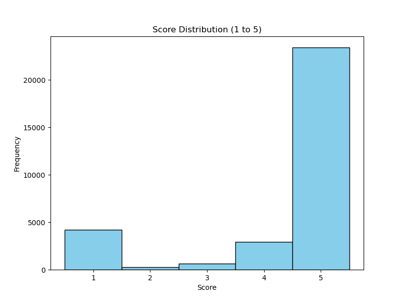
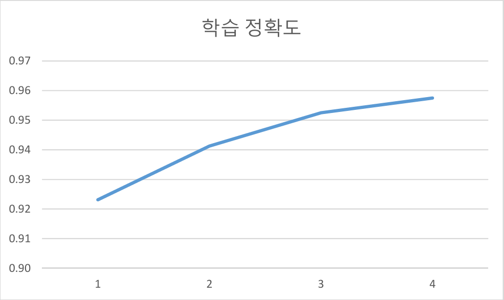
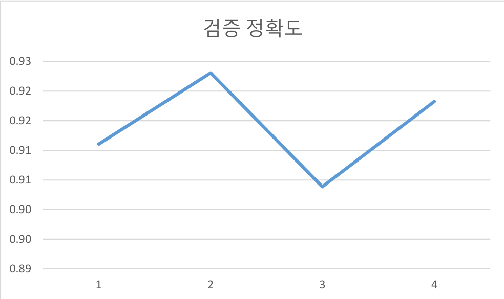
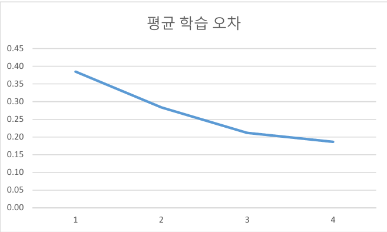

 

# Koelectra를 활용한 hotelapp 리뷰 분석 프로젝트
<!-- 
badge icon 참고 사이트
https://github.com/danmadeira/simple-icon-badges
-->

## 1. 개 요
### 1.1 호텔앱 리뷰의 영향력
호텔앱을 통한 숙박 예약이 늘어나면서 호텔앱은 계속해서 성장해 나가고 있다. 
나는 계속 성장하는 호텔앱 시장을 보고 호텔앱 리뷰를 분석해 보고자 한다. 
호텔앱 시장에서도 소비자들의 리뷰는 매우 중요하다. 소비자들의 리뷰를 통해 
호텔앱이 성장을 할수있고 실제 매출에도 많은 영향을 줄수있다. 한국에서도 
호텔앱 업체에서도 소비자들의 리뷰를 지켜보며 사업방향을 정하는등의 노력을 기울이고 있다. 
### 1.2 문제 정의
한국에서 가장 유명한 두 호텔앱인 야놀자와 여기어때를 사용하는 소비자들의 
앱 리뷰를 포함하고있는 데이터이다. 이 프로젝트에서는 호텔앱 리뷰를 활용해 
한국어 리뷰를 한국어 자연어 처리를 통해 리뷰와 평점 등 다양한 특징에 따라 
긍정 또는 부정을 예측하는 인공지능 모델을 개발하고자 한다. 

## 2. 데이터
### 2.1 원시 데이터
[abouthere_reviews.json](./abouthere_reviews.json) 
[yanolja_reviews.json](./yanolja_reviews.json) 
[abouthere_reviews_2020.json](./abouthere_reviews_2020.json) 
[yanolja_reviews_2020.json](./yanolja_reviews_2020.json) 

[
    {
        "score":5,
        "content":"이용하기 편함",
        "date":"2024-11-04"
    }, 
    {
        "score":4,
        "content":"굿",
        "date":"2024-11-03"
    }, 
    .
    .
    .
] 
abouthere_reviews_2020.json 
[
    {
        "score":5,
        "content":"좋아요 만족합니다",
        "date":"2024-11-04"
    }, 
    {
        "score":5,
        "content":"편리하고 좋아요",
        "date":"2024-11-04"
    }, 
    .
    .
    .
] 
yanolja_reviews_2020.json 
### 2.2 학습 데이터 구축
야놀자앱 리뷰와 여기어때앱 리뷰를 긍부정을 구분하는 라벨링 작업을 진행 
[abouthere_labeled_reviews.json](./abouthere_labeled_reviews.json) 
[yanolja_labeled_reviews.json](./yanolja_labeled_reviews.json) 
[abouthere_2020_labeled_reviews.json](./abouthere_2020_labeled_reviews.json) 
[yanolja_2020_labeled_reviews.json](./yanolja_2020_labeled_reviews.json) 
[
    {
        "score": 5,
        "content": "이용하기 편함",
        "date": "2024-11-04",
        "label": 1
    }, 
    {
        "score": 4,
        "content": "굿",
        "date": "2024-11-03",
        "label": 1
    }, 
    .
    .
    .
] 
abouthere_2020_labeled_reviews.json 
[
    {
        "score": 5,
        "content": "좋아요 만족합니다",
        "date": "2024-11-04",
        "label": 1
    }, 
    {
        "score": 5,
        "content": "편리하고 좋아요",
        "date": "2024-11-04",
        "label": 1
    }, 
    .
    .
    .
] 
yanolja_2020_labeled_reviews.json 
야놀자앱 리뷰와 여기어때앱 리뷰를 2020년이후 리뷰를 합치고  
그중에 라벨이 1인 리뷰 1000건 0인 리뷰 1000건씩 랜덤으로 뽑아  
야놀자앱 리뷰와 여기어때앱 리뷰를 원래 비율에 밪게 샘플링 한다. 
[hotelapp_2020_reviews.json](./hotelapp_2020_reviews.json) 
[hotelapp_sampled_reviews.json](./hotelapp_sampled_reviews.json) 
[
    {
        "score": 5,
        "content": "야놀자해",
        "date": "2022-08-13",
        "label": 1,
        "app": "yanolja"
    }, 
    {
        "score": 5,
        "content": "Good!",
        "date": "2022-10-09",
        "label": 1,
        "app": "yanolja"
    }, 
    .
    .
    .
] 
hotelapp_sampled_reviews.json 
### 2.3 탐색적 데이터 분석
 
리뷰 점수별 분포표
## 3. 한국어 자연어 처리 학습 결과

학습 정확도와 처음에도 높은 수치였지만 끝으로 갈수록 더욱 증가했고 
평균 학습 오차(loss)도 처음 0.38에서 0.19로 줄어들었으므로 긍정 라벨과 
부정 라벨이 맞게 잘 들어가 있고 그러므로 유의미한 결과를 얻었다. 
 
<table>
    <tr>
        <td></td>
        <td></td>
        <td>Epoch1</td>
        <td>Epoch2</td>
        <td>Epoch3</td>
        <td>Epoch4</td>
    </tr>
    <tr>
        <td rowspan="3">학습 데이터</td>
        <td>학습 정확도</td>
        <td>0.923</td>
        <td>0.941</td>
        <td>0.953</td>
        <td>0.958</td>
    </tr>
    <tr>
        <td>검증 정확도</td>
        <td>0.911</td>
        <td>0.923</td>
        <td>0.904</td>
        <td>0.918</td>
    </tr>
    <tr>
        <td>평균 학습 오차</td>
        <td>0.385</td>
        <td>0.283</td>
        <td>0.212</td>
        <td>0.186</td>
    </tr>
</table>
